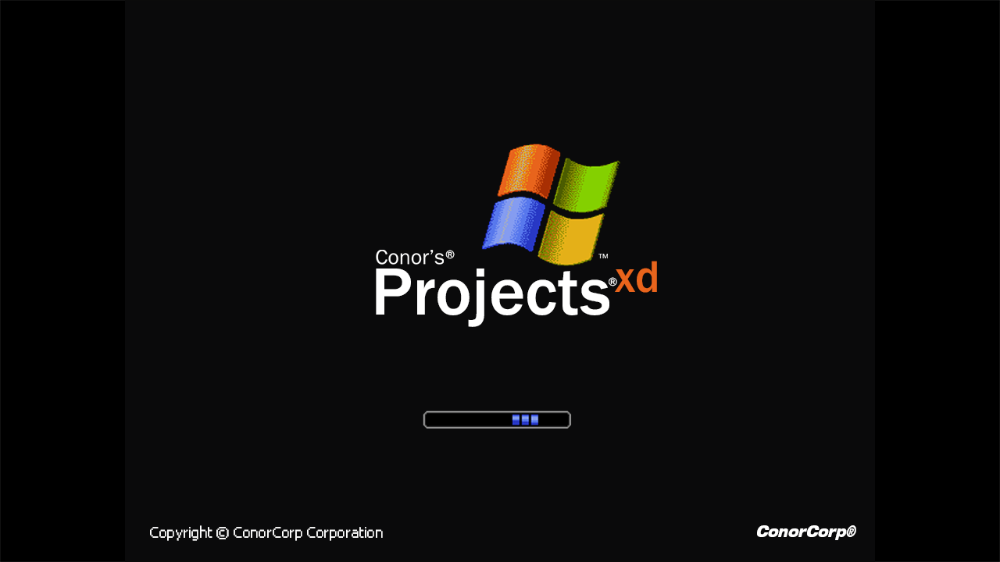
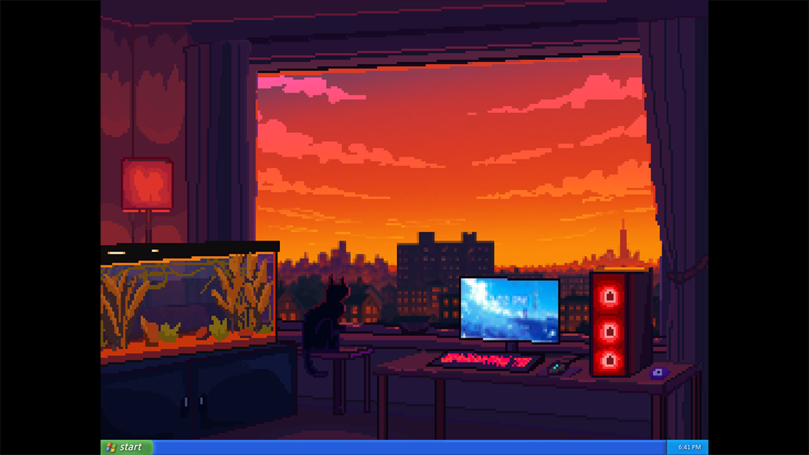
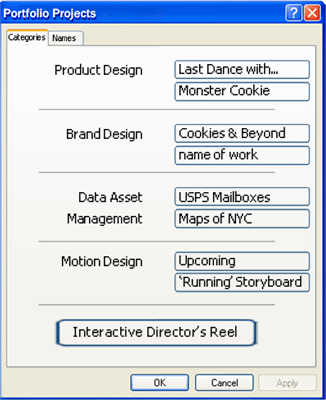

  

<h1 align="center">Windows XP</h1>

  

A replication of the awesome Windows-XP in your browser made by using only the web tools and no library. All rights reserved to <a href="https://www.microsoft.com/en-in">Microsoft&reg;</a>

<h2 align="center">Features</h2>

<table>
  <tr>
    <td><h3>SNo</h3></td>
    <td><h3 align="center">Screenshots</h3></td>
  </tr>

  <tr>
    <td>1.</td>
    <td>
      

      
       
      Splash Screen
      

    </td>
  </tr>
  <tr>
    <td>2.</td>
    <td>
      

      
       
      Welcome Screen
      

    </td>
  </tr>

  <tr>
    <td>3.</td>
    <td>
      

      
       
      Desktop
      

    </td>
  </tr>
  <tr>

  <td>4.</td>
    <td>
      

      
       
      Notepad
      

    </td>
  </tr>
</table>

## License

Full license: [Mozilla Public License V2.0](LICENSE)

## Acknowledgement

This simulation of the windows-XP is made purely for educational purpose and not for any kind of personal profiteering. I don't own it neither do I have any links to it at the moment. All rights reserved to windows-XP are to Microsoft &copy;.
